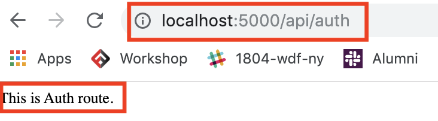

# MERN-Stack-Level2-RawDemo

## `Section: Backend`

## `Part 2: Set up Routes.`

### `Check Dependencies`

- express
- morgan
- nodemon
- mongoose

### `Step1: Set up Route trees`

#### 

- Originally we can add our routes to server.js, but we can organize things a lot better by separating them.

- (Chinese) 正如前端使用 react-router-dom 去组织前端路径树一样，express 也有相似功能让你更好地组织后端路径树,这是提升文档组织性的方法，像工程师一样思考。

#### `A. Add a center route in .server.js, we can call it 'api'`

`Location: server.js`
```js
app.use("/api", require("./api"));
```

#### `B. Create a api folder, create a index.js file inside of it`

`Location: new api folder, ./api/index.js`

- This index.js file is a central clearing house for our api routes, so we can access all api routes by going through "/api" first.

```js
const router = require("express").Router();

router.use("/user", require("./user"));
router.use("/auth", require("./auth"));
router.use("/profile", require("./profile"));
router.use("/post", require("./post"));

module.exports = router;
```

#### `C. Test.`

`set simple contents and test it.`
`Location: ./api/auth.js`
```js
const router = require("express").Router();

router.get(`/`, (req, res) =>{
  res.send(`This is Auth route.`)
})

module.exports = router;
```
`You can get this in browser which mean this route works.`
<p align="center">

</p>

`Note:`
- You can test other routes in this way.