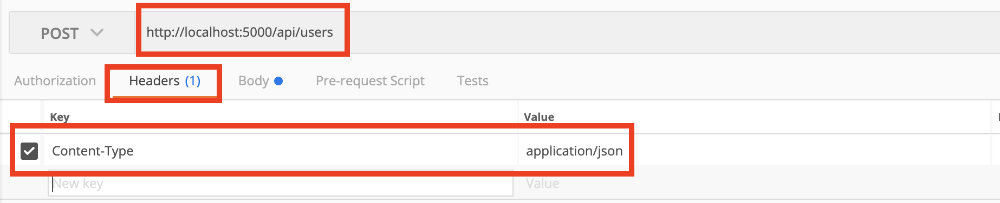
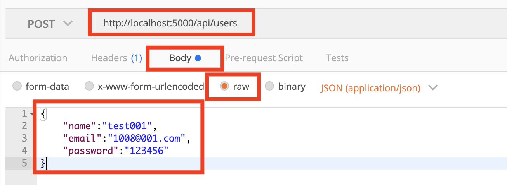
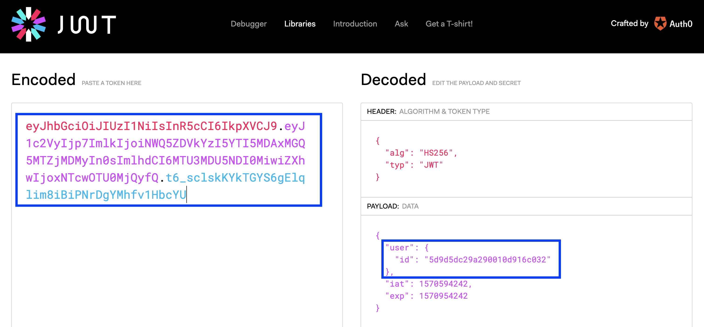

# MERN-Stack-Level2-RawDemo

## `Section: Backend`

## `Part 3: Set up User Route.`

### `Check Dependencies`

- express
- morgan
- nodemon
- mongoose
- express-validator
- gravatar
- bcryptjs
- jsonwebtoken

### `Step1: Set up User model`

#### `B. Create a models folder, create a index.js file inside of it`

`Location: new api folder, ./api/index.js`

- This index.js file is a central clearing house for our api routes, so we can access all api routes by going through "/api" first.

```js
const User = require('./User.js');
const Post = require('./Post.js');
const Profile = require('./Profile,js');

module.exports = { User, Post, Profile };
```

#### `C. Create User model.`

`Location: ./models/User.js`

```js
//Require dependency
const mongoose = require('mongoose');
//Create a schema, so UserSchema is a instance of mongoose Schema class
const UserSchema = new mongoose.Schema({
  name: {
    type: String,
    required: true
  },
  email: {
    type: String,
    required: true,
    unique: true
  },
  password: {
    type: String,
    required: true
  },
  avatar: {
    type: String
  },
  date: {
    type: Date,
    default: Date.now
  }
});

module.exports = User = mongoose.model('user', UserSchema);
```

`note:`

- In this model, we use two mongoose built-in methods.
- One is mongoose.Schema, which will create a Schema instance.
- The other one is mongoose.model('user', UserSchema), takes two arguments, the first one as a collecion name in
  MongoDB Altas, the second one is Schema instance name.

- In the end of this file, it export a Model.

- Create a Schema ====> Create a model ====> export the model

### `Step2: Create Post User Route`

#### `A. Install dependencies`

```bash
$ npm install express-validator
```

#### `B. Add post route validation`

`Location: /api/user.js`

```js
const router = require('express').Router();
const { check, validationResult } = require('express-validator');
//@route   Post api/user
//@desc    Register new user
//@access  Public
router.post(
  '/',
  [
    check('name', 'Name is required')
      .not()
      .isEmpty(),
    check('email', 'Please include a valid email').isEmail(),
    check(
      'password',
      'Please enter a password with 6 or more charters'
    ).isLength({ min: 6 })
  ],
  (req, res) => {
    const errors = validationResult(req);
    if (!errors.isEmpty()) {
      return res.status(400).json({ errors: errors.array() });
    }
    res.send('User route.');
  }
);

module.exports = router;
```

#### `C. Side-note: How does the route validation work?`

- In express route, there are 3 arguments, the second one is the validation one which is an option, if you have more than 1 validation, you should put them into a `[]`.
- In this case, we put validations in the second argument, and check three things:
  `req.body.name`, `req.body.email`, `req.body.password`.

##### `Why we can check these three in this way?`

##### First, we already added middleware in server.js

```js
app.use(express.json({ extended: false }));
```

##### Second, it depends on the way we send data in Postman

<p align="center">

</p>
<p align="center">

</p>

- We invoke the built-in function `validationResult(req)`, req is the argument, the function will return error if some of the `req` is not satisfy the check conditions.

- If it has error, the route will return some error message.

#### `D. Add post route response`

##### - `Install dependency`

```bash
$ npm install gravatar --save
$ npm install bcryptjs --save
```

`Location: /api/user.js`

##### - Add model, add dependencies.

```js
const gravatar = require('gravatar');
const bcrypt = require('bcryptjs');
const { User } = require('../models');
```

##### - Change the response in async way.

```js
async (req, res) => {
  const errors = validationResult(req);
  if (!errors.isEmpty()) {
    return res.status(400).json({ errors: errors.array() });
  }

  const { name, email, password } = req.body;

  try {
    // a. See if user exists
    let user = await User.findOne({ email: email });

    if (user) {
      return res.status(400).json({ errors: [{ msg: 'User already exists' }] });
    }

    // b. Get users gravatar
    const avatar = gravatar.url(email, {
      s: '200',
      r: 'pg',
      d: 'mm'
    });

    // c. Create a new user instance by User model, now user is a real object
    newUser = new User({
      name,
      email,
      avatar,
      password
    });
    //console.log(user);

    // d. Encrypt password
    const salt = await bcrypt.genSalt(10);
    // Change the object attribute
    newUser.password = await bcrypt.hash(password, salt);
    // e. Save the object in MongoDB Altas
    newUser.save();

    // f. Return json-web-token
    res.send('User register');
  } catch (err) {
    console.error(err.message);
    res.status(500).send('Server error');
  }
};

module.exports = router;
```

`Side-Note:`

- Validate the req.body ===> Check if the user existed ===> Get gravatar ===> Create a real object `newUser` by User model ===> Encrypt password and modify the value of `newUser.password` ===> Save the `newUser` in database.

#### `E. Implementing Json-Web-Token`

`Location: /api/user.js`

##### `Install dependency`

```bash
$ npm install jsonwebtoken --save
```

##### - Add dependency.

```js
const jwt = require('jsonwebtoken');
```

```js
// f. Return json-web-token
const payload = {
  newUser: {
    id: newUser.id
  }
};

jwt.sign(
  payload,
  'mysecrettoken',
  {
    expiresIn: 360000
  },
  (err, token) => {
    if (err) throw err;
    res.json({ token : token});
  }
);
```

#### `Side-Note(Chinese):`

- payload 是一个 object；
- jwt.sign 是一个依赖中的内建函数，它有四个参数，第一个是目标对象，第二个是打包码，第三个是包裹有效时间，第四个是可选参数，是一个回调函数，对打包过程的一个反馈。
- 总的来说，jwt.sign 就是一个数据打包函数，输入数据和打包钥匙，最后生成一个有数据包信息的令牌数据(一个全新object，只有一对键值)，其实就是一个数据变形的过程。
- 要补充的是，本程序设定的是重复用户的定义是不能有相同的电子邮箱。
- 在这里有一个建议就是，最好不要把 Connection String 和 jwtSecret 上传和公开。
- 在语句`newUser.save();`之后， 我们就可以通过`newUser.id`去获得newUser在MongoDB中的`_id`。

#### `F. Final post route code`

```js
const router = require('express').Router();
const { check, validationResult } = require('express-validator');
const gravatar = require('gravatar');
const bcrypt = require('bcryptjs');
const jwt = require('jsonwebtoken');

const { User } = require('../models');

//@route   Post api/user
//@desc    Register new user
//@access  Public

router.post(
  '/',
  [
    check('name', 'Name is required')
      .not()
      .isEmpty(),
    check('email', 'Please include a valid email').isEmail(),
    check(
      'password',
      'Please enter a password with 6 or more charters'
    ).isLength({ min: 6 })
  ],
  async (req, res) => {
    const errors = validationResult(req);
    if (!errors.isEmpty()) {
      return res.status(400).json({ errors: errors.array() });
    }

    const { name, email, password } = req.body;
    try {
      let user = await User.findOne({ email: email });

      if (user) {
        return res
          .status(400)
          .json({ errors: [{ msg: 'User already exists' }] });
      }

      const avatar = gravatar.url(email, {
        s: '200',
        r: 'pg',
        d: 'mm'
      });

      newUser = new User({
        name,
        email,
        avatar,
        password
      });

      const salt = await bcrypt.genSalt(10);

      newUser.password = await bcrypt.hash(password, salt);

      newUser.save();

      // Now you get the access to the newUser._id in MongoDB Altas.
      const payload = {
        newUser: {
          id: newUser.id
        }
      };

      jwt.sign(
        payload,
        'mysecrettoken',
        {
          expiresIn: 360000
        },
        (err, token) => {
          if (err) throw err;
          res.json({ token : token});
        }
      );
    } catch (err) {
      console.error(err.message);
      res.status(500).send('Server error');
    }
  }
);

module.exports = router;
```

#### `G Test it`
- In postman
<p align="center">

</p>

- In jwt.io
<p align="center">

</p>

- In MongoDB Altas
<p align="center">

</p>
