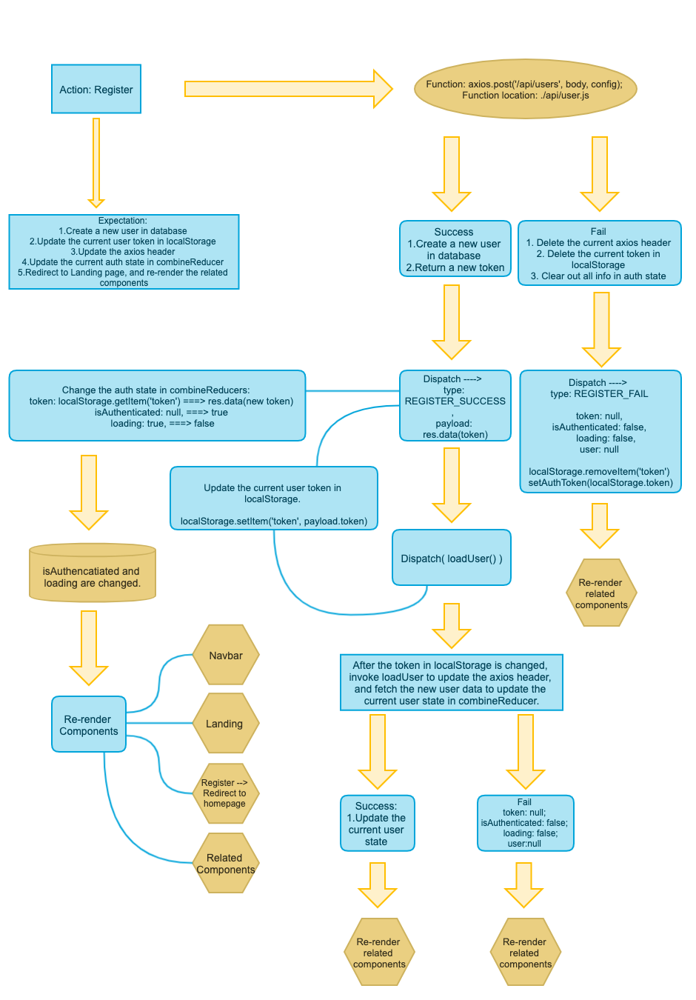
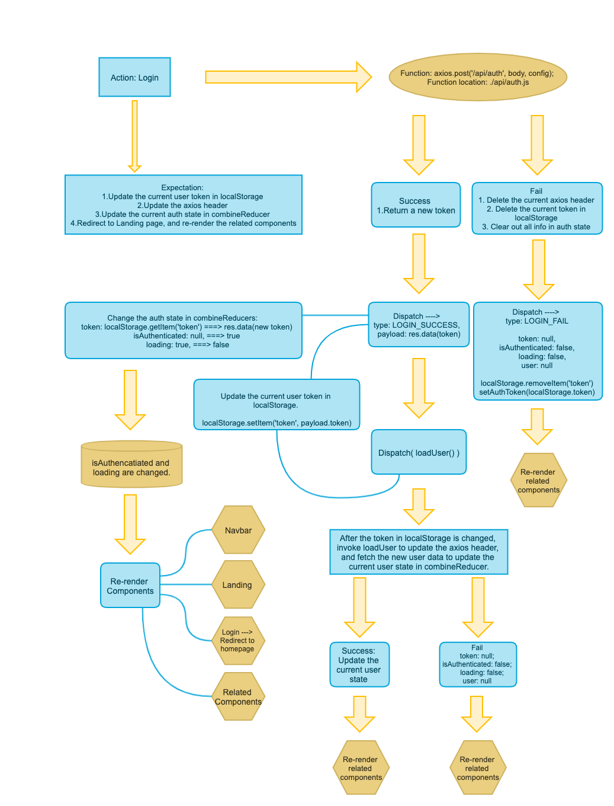

# MERN-Template(part 15)
## `Section: Design`(Front End)

### Summary: In this documentation, we talk about the Authentication logic.

#### `Register:`

#### `Login:`

#### `Load User:`

#### `Logout:`

