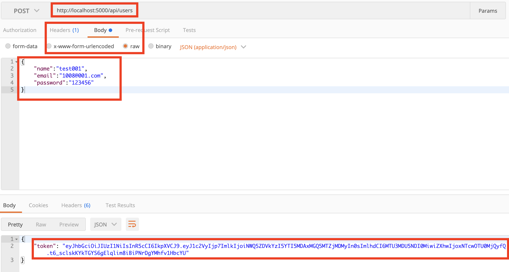
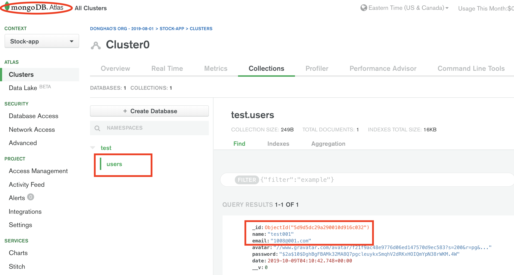

# MERN-Template(part 6)
## `Section: Frontend`(Install Front end dependencies and clean up code)

### `Summary`: In this documentation, we install some dependencies and clean up some code, we also set up react-router to the project.

### `Check Dependencies:`

- concurrently (back-end)
- react
- axios
- react-router-dom
- redux
- react-redux
- redux-thunk
- redux-devtools-extension
- moment
- react-moment
- uuid

### `Brief Contents & codes position`
- *4.1 Create a middleware call 'auth' `./middleware/auth.js`
- *4.2 Create a auth routh, `./api/auth.js`

### `Step1: Install dependencies:`

```bash
$ npx create-react-app client
$ npm install concurrently
$ cd client
$ npm install axios react-router-dom redux react-redux redux-thunk redux-devtools-extension moment react-moment uuid
$ rm -rf .git
$ cd ..
```
### `Step2: Delete some files.`

#### `Location: ./client folder`
- .gitignore
- README.md

#### `Location: ./client/src folder`
- serviceWorker.js
- logo.svg
- index.css
- App.test.js

### `Step3: Add some files.`

#### `Location: ./client folder`
- new folder call 'img'
- add a picture into 'img' folder

#### `Location: ./client/src folder`
- new folder call 'components'

#### `Location: ./client/src/components folder`
- new folder call 'layout'

#### `Location: ./client/src/components folder`
- new file call 'Landing.js'
- new file call 'Navbar.js'

### `Step4: Add some code in package.json.`

#### `Location: ./client/package.json`

```diff
+ "proxy": "http://localhost:5000"
```

#### `Location: ./package.json`

```diff
+ "client": "npm start --prefix client",
+ "dev": "concurrently \"npm run server\" \"npm run client\""
```

### `Step5: Change some code.`

`(*6.1)Location: ./client/src/index.js`

```js
import React from 'react';
import ReactDOM from 'react-dom';
import App from './App';

ReactDOM.render(<App />, document.getElementById('root'));
```

`(*6.2)Location: ./client/src/App.js`

```js
import React, { Fragment } from 'react';
import './App.css';

const App = () =>
  <Fragment>
    <h1>Hello</h1>
  </Fragment>

export default App;
```

`(*6.3)Location: ./client/src/App.css`

```css
/* Global Styles */
:root {
  --primary-color: #17a2b8;
  --dark-color: #343a40;
  --light-color: #f4f4f4;
  --danger-color: #dc3545;
  --success-color: #28a745;
}

* {
  box-sizing: border-box;
  margin: 0;
  padding: 0;
}

body {
  font-family: 'Raleway', sans-serif;
  font-size: 1rem;
  line-height: 1.6;
  background-color: #fff;
  color: #333;
}

a {
  color: var(--primary-color);
  text-decoration: none;
}

ul {
  list-style: none;
}

img {
  width: 100%;
}

/* Utilities */
.container {
  max-width: 1100px;
  margin: auto;
  overflow: hidden;
  padding: 0 2rem;
  margin-top: 6rem;
  margin-bottom: 3rem;
}

/* Text Styles*/
.x-large {
  font-size: 4rem;
  line-height: 1.2;
  margin-bottom: 1rem;
}

.large {
  font-size: 3rem;
  line-height: 1.2;
  margin-bottom: 1rem;
}

.lead {
  font-size: 1.5rem;
  margin-bottom: 1rem;
}

.text-center {
  text-align: center;
}

.text-primary {
  color: var(--primary-color);
}

.text-dark {
  color: var(--dark-color);
}

/* Padding */
.p {
  padding: 0.5rem;
}
.p-1 {
  padding: 1rem;
}
.p-2 {
  padding: 2rem;
}
.p-3 {
  padding: 3rem;
}
.py {
  padding: 0.5rem 0;
}
.py-1 {
  padding: 1rem 0;
}
.py-2 {
  padding: 2rem 0;
}
.py-3 {
  padding: 3rem 0;
}

/* Margin */
.m {
  margin: 0.5rem;
}
.m-1 {
  margin: 1rem;
}
.m-2 {
  margin: 2rem;
}
.m-3 {
  margin: 3rem;
}
.my {
  margin: 0.5rem 0;
}
.my-1 {
  margin: 1rem 0;
}
.my-2 {
  margin: 2rem 0;
}
.my-3 {
  margin: 3rem 0;
}

.btn {
  display: inline-block;
  background: var(--light-color);
  color: #333;
  padding: 0.4rem 1.3rem;
  font-size: 1rem;
  border: none;
  cursor: pointer;
  margin-right: 0.5rem;
  transition: opacity 0.2s ease-in;
  outline: none;
}

.badge {
  font-size: 0.8rem;
  padding: 0.1rem;
  text-align: center;
  margin: 0.3rem;
  background: var(--light-color);
  color: #333;
}

.alert {
  padding: 0.8rem;
  margin: 1rem 0;
  opacity: 0.9;
  background: var(--light-color);
  color: #333;
}

.btn-primary,
.bg-primary,
.badge-primary,
.alert-primary {
  background: var(--primary-color);
  color: #fff;
}

.btn-light,
.bg-light,
.badge-light,
.alert-light {
  background: var(--light-color);
  color: #333;
}

.btn-dark,
.bg-dark,
.badge-dark,
.alert-dark {
  background: var(--dark-color);
  color: #fff;
}

.btn-danger,
.bg-danger,
.badge-danger,
.alert-danger {
  background: var(--danger-color);
  color: #fff;
}

.btn-success,
.bg-success,
.badge-success,
.alert-success {
  background: var(--success-color);
  color: #fff;
}

.btn-white,
.bg-white,
.badge-white,
.alert-white {
  background: #fff;
  color: #333;
  border: #ccc solid 1px;
}

.btn:hover {
  opacity: 0.8;
}

.bg-light,
.badge-light {
  border: #ccc solid 1px;
}

.round-img {
  border-radius: 50%;
}

.line {
  height: 1px;
  background: #ccc;
  margin: 1.5rem 0;
}

/* Overlay */
.dark-overlay {
  background-color: rgba(0, 0, 0, 0.7);
  position: absolute;
  top: 0;
  left: 0;
  width: 100%;
  height: 100%;
}

/* Forms */
.form .form-group {
  margin: 1.2rem 0;
}

.form .form-text {
  display: block;
  margin-top: 0.3rem;
  color: #888;
}

.form input[type='text'],
.form input[type='email'],
.form input[type='password'],
.form input[type='date'],
.form select,
.form textarea {
  display: block;
  width: 100%;
  padding: 0.4rem;
  font-size: 1.2rem;
  border: 1px solid #ccc;
}

.form input[type='submit'],
button {
  font: inherit;
}

.form .social-input {
  display: flex;
}

.form .social-input i {
  padding: 0.5rem;
  width: 4rem;
}

.form .social-input i.fa-twitter {
  color: #38a1f3;
}
.form .social-input i.fa-facebook {
  color: #3b5998;
}
.form .social-input i.fa-instagram {
  color: #3f729b;
}
.form .social-input i.fa-youtube {
  color: #c4302b;
}
.form .social-input i.fa-linkedin {
  color: #0077b5;
}

.table th,
.table td {
  padding: 1rem;
  text-align: left;
}

.table th {
  background: var(--light-color);
}

/* Navbar */
.navbar {
  display: flex;
  justify-content: space-between;
  align-items: center;
  padding: 0.7rem 2rem;
  position: fixed;
  z-index: 1;
  width: 100%;
  top: 0;
  border-bottom: solid 1px var(--primary-color);
  opacity: 0.9;
}

.navbar ul {
  display: flex;
}

.navbar a {
  color: #fff;
  padding: 0.45rem;
  margin: 0 0.25rem;
}

.navbar a:hover {
  color: var(--primary-color);
}

.navbar .welcome span {
  margin-right: 0.6rem;
}

/* Landing Page */
.landing {
  position: relative;
  background: url('./img/background.jpg') no-repeat center center/cover;
  height: 100vh;
}

.landing-inner {
  color: #fff;
  height: 100%;
  width: 80%;
  margin: auto;
  display: flex;
  flex-direction: column;
  align-items: center;
  justify-content: center;
  text-align: center;
}

/* Profiles Page */
.profile {
  display: grid;
  grid-template-columns: 2fr 4fr 2fr;
  align-items: center;
  grid-gap: 2rem;
  padding: 1rem;
  line-height: 1.8;
  margin-bottom: 1rem;
}

/* Profile Page */
.profile-grid {
  display: grid;
  grid-template-areas:
    'top top'
    'about about'
    'exp edu'
    'github github';
  grid-gap: 1rem;
}

.profile-top {
  grid-area: top;
  display: flex;
  flex-direction: column;
  align-items: center;
  justify-content: center;
  text-align: center;
}

.profile-top img {
  width: 250px;
}

.profile-top .icons a {
  color: #fff;
  margin: 0 0.3rem;
}

.profile-top .icons a:hover {
  color: var(--dark-color);
}

.profile-about {
  grid-area: about;
  text-align: center;
}

.profile-about .skills {
  display: flex;
  align-items: center;
  justify-content: center;
  text-align: center;
}

.profile-exp {
  grid-area: exp;
}

.profile-edu {
  grid-area: edu;
}

.profile-exp h2,
.profile-edu h2 {
  margin-bottom: 1rem;
}

.profile-exp > div,
.profile-edu > div {
  margin-bottom: 1rem;
  padding-bottom: 1rem;
  border-bottom: #ccc 1px dotted;
}

.profile-exp > div:last-child,
.profile-edu > div:last-child {
  border: 0;
}

.profile-exp p,
.profile-edu p {
  margin: 0.5rem 0;
}

.profile-github {
  grid-area: github;
}

.profile-github .repo {
  display: flex;
}

.profile-github .repo > div:first-child {
  flex: 7;
  flex-basis: 70%;
}

.profile-github > div:last-child {
  flex: 3;
  flex-basis: 20%;
}

/* Posts Page */
.post-form .post-form-header {
  background: var(--primary-color);
  padding: 0.5rem;
}

.post {
  display: grid;
  grid-template-columns: 1fr 4fr;
  grid-gap: 2rem;
  align-items: center;
}

.post > div:first-child {
  text-align: center;
}

.post img {
  width: 100px;
}

.post .comment-count {
  background: var(--light-color);
  color: var(--primary-color);
  padding: 0.1rem 0.2rem;
  border-radius: 5px;
  font-size: 0.8rem;
}

.post .post-date {
  color: #aaa;
  font-size: 0.8rem;
  margin-bottom: 0.5rem;
}

/* Mobile Styles */
@media (max-width: 700px) {
  .container {
    margin-top: 8rem;
  }

  .hide-sm {
    display: none;
  }

  /* Text Styles */
  .x-large {
    font-size: 3rem;
  }

  .large {
    font-size: 2rem;
  }

  .lead {
    font-size: 1rem;
  }

  /* Navbar */
  .navbar {
    display: block;
    text-align: center;
  }

  .navbar ul {
    text-align: center;
    justify-content: center;
  }

  .navbar h1 {
    margin-bottom: 1rem;
  }

  .navbar .welcome {
    display: none;
  }

  /* Profiles Page */
  .profile {
    grid-template-columns: 1fr;
    text-align: center;
  }

  .profile ul {
    display: none;
  }

  /* Profile Page */

  .profile-top img,
  .profile img {
    width: 200px;
    margin: auto;
  }

  .profile-grid {
    grid-template-areas:
      'top'
      'about'
      'exp'
      'edu'
      'github';
  }

  .profile-about .skills {
    flex-direction: column;
  }

  .dash-buttons a {
    display: block;
    width: 100%;
    margin-bottom: 0.2rem;
  }

  .post {
    grid-template-columns: 1fr;
  }
  .post a,
  .post button {
    padding: 0.3rem 0.4rem;
  }
}

th, td {
    border: 1px solid black;
    padding: 20px;
    text-align: center;
    font-size: 1.2rem;
}

.tran_header{
  font-size: 2rem;
  color: #0077b5;
  margin: 2rem auto;
}


.portfolio_container{
  display: flex;
  flex-wrap: wrap;
  justify-content: space-between;
}
.holding_stocks{
  margin-right: 20px;
}

.green{
  color:green;
}

.red{
  color:red;
}
.grey{
  color:grey
}
```


#### `Create a new folder call 'middleware', Location:`

`(*4.1)Location: ./middleware/auth.js`

```js
const jwt = require('jsonwebtoken');
const config = require('config');
const secret = config.get('jwtSecret');

module.exports = function(req, res, next) {
  // Get token form header
  const token = req.header('x-auth-token');

  //Check if not token
  if (!token) {
    return res.status(401).json({ msg: 'No token, authorization denied.' });
  }

  try {
    const decoded = jwt.verify(token, secret);

    req.user = decoded.user;//{id: user.id}

    next();
  } catch (err) {
    res.staus(401).json({ msg: 'Token is not valid' });
  }
};
```

#### `Side-note(Chinese):`

- 这个中间件的用途在于在调用实际 API 之前对 request 进行预处理或者过滤处理，比如在这个中间件中，先提取`req.header的‘x-auth-token’`部分,然后进行判断有无，然后使用 jsonwebtoken 的内建函数进行解码。
- 需要注意的是 jwt.verify()函数需要两个参数，一个是 request 中的令牌，另外一个是打包令牌时使用的钥匙，这个函数返回的是打包前的原本数据。
- 我们只提取原本数据中的`user`值，并把值附在 request 上面，这样 req 就有了一个新的 key pair<br>(即`req.user = { id: user.id}`)。
- 这个中间件的设置是，如果解码成功，则把改造后的 req 穿到下一个中间件或者实际 API 函数，如果解码不成功，产生错误并反馈。
- #### `这个中间件的编导逻辑很重要，需要重点反复练习。`

### `Step3: Use the new middleware in auth get route.`

`(*4.2)Location:./api/auth.js`

```js
const router = require('express').Router();
const auth = require('../middleware/auth');

const { User } = require('../models');

//@route   Get api/auth
//@desc    Authenticate user & get token
//@access  Public

router.get(`/`, auth, async (req, res) => {
  try {
    const user = await User.findById(req.user.id).select('-password');
    res.json(user);
  } catch (err) {
    console.error(err.message);
    res.status(500).send('Server Error.');
  }
});

module.exports = router;
```

#### `Side-note(Chinese):`

- request 通过中间件之后，req.user.id 的值就是对应的 user 在 MongoDB Altas 中的`_id`值。
- 我们可以通过 model `User.findById`获得对应的 user 数据。

- 整个过程可以归结为：

<ol>
<li>创建一个新用户，用jsonwebtoken内建函数将生成的MongoDB ALtas对应的数据的`_id`值打包，并返回一个令牌，这过程需要一个自定义打包钥匙。</li>
<li>创建一个中间件，捕获header的‘x-auth-token’值，并用打包钥匙对其进行解码，获得原始数据，把原始数据的id值赋值在request中。</li>
<li>在auth的get路径中，当request经过中间件auth后，req.user.id就是令牌中原始数据的user.id值。</li>
<li>通过 model `User.findById`获得对应的 user 数据</li>
</ol>

#### `总结`：
- 在这个Get route中，request是不需要任何参数的，只需要在x-auth-token输入token就可以返回相应令牌里面对应的用户信息，在这个过程中要注意打包钥匙(const secret = 'mysecrettoken')的前后一致性才能解码成功。

### `Step4: Test it.`

- In postman: Post a new user(localhost:5000/api/user)
<p align="center">

</p>

- In postman: Get a user(localhost:5000/api/auth)
<p align="center">

</p>

- Data in MongoDB Altas
<p align="center">

</p>