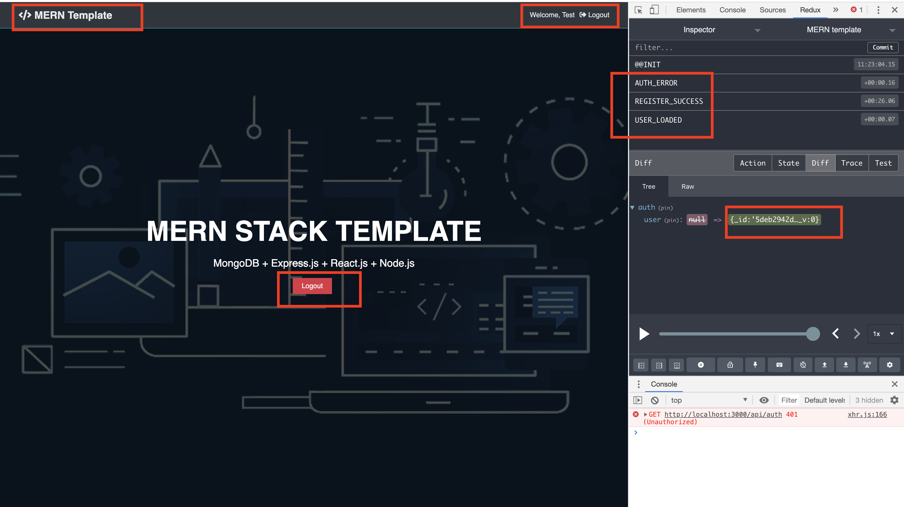
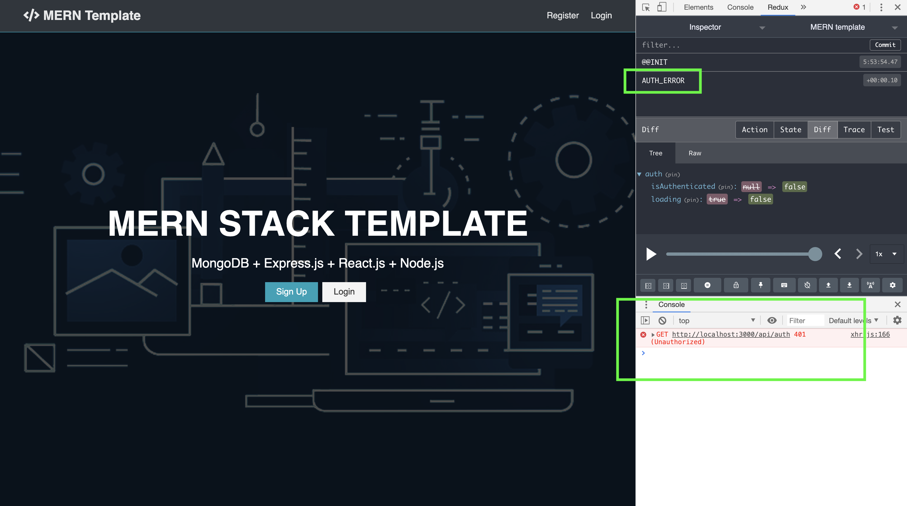

### #1
#### Time: 12/06/2019

#### Topic: Add a feature in Landing page and fix some arguments.

- 1.1`Location: ./client/src/components/layout/Landing.js`

```js
import React, { Fragment } from 'react';
import { Link } from 'react-router-dom';
import { connect } from 'react-redux';
import PropTypes from 'prop-types';
import { logout } from '../../actions/auth'

const Landing = props => {
    const { logout, isAuthenticated, loading } = props;
    const authLinks = (
        <a onClick={logout} href='/' className="btn btn-danger">Logout</a>
    );

    const guestLinks = (
        <Fragment>
            <Link to="/register" className="btn btn-primary">Sign Up</Link>
            <Link to="/login" className="btn btn-light">Login</Link>
        </Fragment>
    );
    return (
        <section className="landing">
            <div className="dark-overlay">
                <div className="landing-inner">
                    <h1 className="x-large">MERN STACK TEMPLATE</h1>
                    <p className="lead">MongoDB + Express.js + React.js + Node.js</p>
                    <div className="buttons">
                        {!loading ? (
                            <Fragment>
                                {
                                    isAuthenticated ? authLinks : guestLinks
                                }
                            </Fragment>
                        ) : null}
                    </div>
                </div>
            </div>
        </section>
    )
}

Landing.propTypes = {
    logout: PropTypes.func.isRequired,
    isAuthenticated: PropTypes.bool,
    loading: PropTypes.bool.isRequired,
}

const mapStateToProps = state => ({
    isAuthenticated: state.auth.isAuthenticated,
    loading: state.auth.loading,
})

export default connect(mapStateToProps, { logout })(Landing);
```

- 1.2`Location: ./client/src/components/layout/Navbar.js`
- 1.3`Location: ./client/src/components/actions/alert.js`

#### Now after the user login or register, the landing page looks like this:

<p align="center">

</p>

<p align="center">

</p>


### #2
#### Time: 12/06/2019

#### Topic: After you push everything and want to add a new rule in .gitignore file, usually it doesn't work, the way to make it work is(后来添加的新的忽略规则不生效的处理方法):

```bash
$ git rm -r --cached .
$ git add .
$ git commit -m "update .gitignore"
```

### #3
#### Time: 12/07/2019

#### Topic: In file `./client/App.js`, why use this code before component? Then run the same code in useEffect()?

```js
if (localStorage.token) {
  setAuthToken(localStorage.token);
}
```

```js
  useEffect(() => {
    store.dispatch(loadUser());
  }, []);
```

### #4
#### Time: 12/07/2019

#### Topic: In order to fix this error, 

<p align="center">

</p>

#### I make this changes:
- 4.1`Location: ./client/src/actions/auth.js`

`From:`
```js
export const loadUser = () => async dispatch => {
    if (localStorage.token) {
        setAuthToken(localStorage.token);
    }
    try {
        const res = await axios.get('/api/auth');
        dispatch({
            type: USER_LOADED,
            payload: res.data,
        })
    } catch (error) {
        dispatch({
            type: AUTH_ERROR
        })
    }
}
```

`To:`
```js
export const loadUser = () => async dispatch => {
    if (localStorage.token) {
        /*
        when token is in localStorage, 
        update it in axio header whenever 
        you call this function.*/
        setAuthToken(localStorage.token);

        try {
            const res = await axios.get('/api/auth');
            dispatch({
                type: USER_LOADED,
                payload: res.data,
            })
        } catch (error) {
            dispatch({
                type: USER_LOAD_FAIL
            })
        }
    }
    else {
        dispatch({
            type: NO_TOKEN_IN_LOCAL_STORAGE
        })
    }
}
```

- 4.2`Location: ./client/src/actions/types`
- 4.2`Location: ./client/src/reducers/auth.js`