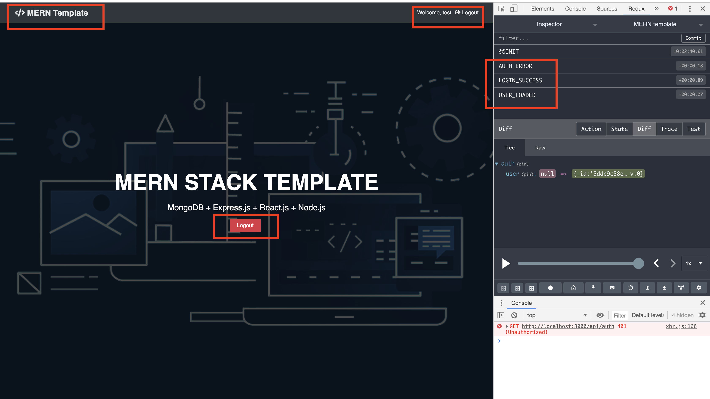

### `Number: 1`
#### Time: 12/06/2019

#### Topic: Add a feature in Landing page and fix some arguments.

1.1`Location: ./client/src/components/layout/Landing.js`

```js
import React, { Fragment } from 'react';
import { Link } from 'react-router-dom';
import { connect } from 'react-redux';
import PropTypes from 'prop-types';
import { logout } from '../../actions/auth'

const Landing = props => {
    const { logout, isAuthenticated, loading } = props;
    const authLinks = (
        <a onClick={logout} href='/' className="btn btn-danger">Logout</a>
    );

    const guestLinks = (
        <Fragment>
            <Link to="/register" className="btn btn-primary">Sign Up</Link>
            <Link to="/login" className="btn btn-light">Login</Link>
        </Fragment>
    );
    return (
        <section className="landing">
            <div className="dark-overlay">
                <div className="landing-inner">
                    <h1 className="x-large">MERN STACK TEMPLATE</h1>
                    <p className="lead">MongoDB + Express.js + React.js + Node.js</p>
                    <div className="buttons">
                        {!loading ? (
                            <Fragment>
                                {
                                    isAuthenticated ? authLinks : guestLinks
                                }
                            </Fragment>
                        ) : null}
                    </div>
                </div>
            </div>
        </section>
    )
}

Landing.propTypes = {
    logout: PropTypes.func.isRequired,
    isAuthenticated: PropTypes.bool,
    loading: PropTypes.bool.isRequired,
}

const mapStateToProps = state => ({
    isAuthenticated: state.auth.isAuthenticated,
    loading: state.auth.loading,
})

export default connect(mapStateToProps, { logout })(Landing);
```

1.2`Location: ./client/src/components/layout/Navbar.js`
1.3`Location: ./client/src/components/actions/alert.js`

#### Now after the user login or register, the landing page looks like this:

<p align="center">

</p>
