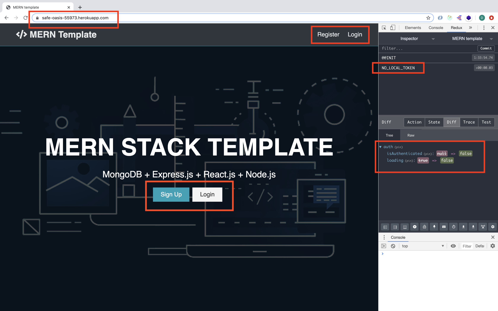

# MERN-Template-Documentation-Guide

## This is a documentation about creating the MERN stack.

## Final view(deployed):

### `Update notes:`[MERN Stack Doc V1 Update file - Check here](https://github.com/DonghaoWu/MERN-Doc-V1/blob/master/README-Folder/Update.md)

### `References:`

- [Part1 - Setup](https://github.com/DonghaoWu/MERN-Doc-V1/blob/master/README-Folder/Setup(part1).md)
- [Part2 - Route Tree](https://github.com/DonghaoWu/MERN-Doc-V1/blob/master/README-Folder/USER-API(part2-5)/2-ROUTE-TREE.md)
- [Part3 - Create User](https://github.com/DonghaoWu/MERN-Doc-V1/blob/master/README-Folder/USER-API(part2-5)/3-Create-User.md)
- [Part4 - Get User By Token](https://github.com/DonghaoWu/MERN-Doc-V1/blob/master/README-Folder/USER-API(part2-5)/4-Get-User-ByToken.md)
- [Part5 - Login User](https://github.com/DonghaoWu/MERN-Doc-V1/blob/master/README-Folder/USER-API(part2-5)/5-LogIn-User.md)
- [Part6 - React Initiation](https://github.com/DonghaoWu/MERN-Doc-V1/blob/master/README-Folder/Front-end(part6-9)/6-React-Initiation.md)
- [Part7 - Router Form](https://github.com/DonghaoWu/MERN-Doc-V1/blob/master/README-Folder/Front-end(part6-9)/7-Router-Form.md)
- [Part8 - Redux Initiation](https://github.com/DonghaoWu/MERN-Doc-V1/blob/master/README-Folder/Front-end(part6-9)/8-Redux-Initiation.md)
- [Part9 - Redux Connection](https://github.com/DonghaoWu/MERN-Doc-V1/blob/master/README-Folder/Front-end(part6-9)/9-Redux-Connection.md)
- [Part10 - Register](https://github.com/DonghaoWu/MERN-Doc-V1/blob/master/README-Folder/User-Authentication(part10-13)/10-Register.md)
- [Part11 - Load User & Auth](https://github.com/DonghaoWu/MERN-Doc-V1/blob/master/README-Folder/User-Authentication(part10-13)/11-Load-User%26Auth.md)
- [Part12 - Login & Redirect](https://github.com/DonghaoWu/MERN-Doc-V1/blob/master/README-Folder/User-Authentication(part10-13)/12-Login-Redirect.md)
- [Part13 - Logout](https://github.com/DonghaoWu/MERN-Doc-V1/blob/master/README-Folder/User-Authentication(part10-13)/13-Logout.md)
- [Part14 - Deploy](https://github.com/DonghaoWu/MERN-Doc-V1/blob/master/README-Folder/README-DEPLOY.md)

